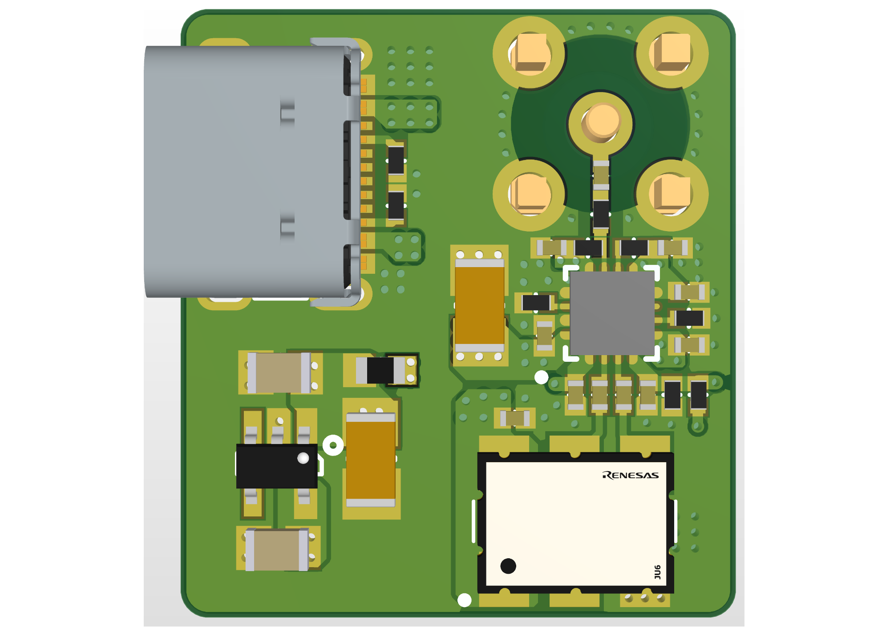

# fastedge-ADCMP572

Fast rising-edge generator board for time-domain measurements and high-bandwidth scope/probe characterization.

## Specs

- **Edge speed:** < 50 ps rise time
- **Comparator:** Analog Devices ADCMP572 (SiGe, ~37 ps min rise/fall)
- **Clock input:** LVDS on-board oscillator
- **Power:** USB-C (5 V)

## How it works

LVDS clock from the oscillator drives the ADCMP572 differential inputs. The comparator squares the sine/clock into a clean CML output with a sub-50 ps edge, suitable as a stimulus for:

- TDR (cable/PCB trace impedance profiling)
- Oscilloscope / active probe rise-time verification
- Bandwidth estimation via the `BW ≈ 0.35 / t_r` rule (≥ 7 GHz at 50 ps)

## Repo layout

- `fastedge-ADCMP572.PrjPcb` — Altium Designer project
- `fastedge-ADCMP572.SchDoc` — schematic
- `fastedge-ADCMP572.PcbDoc` — PCB layout
- `outputs/` — generated Gerbers, NC drill, BOM, STEP, PDF schematic/assembly, ODB++

## Fab outputs

Latest revision under `outputs/fastedge-ADCMP572 v1/`:
- Gerber + NC Drill
- BOM (`.xlsx`)
- 3D model (`.step`)
- [Schematic & board views (PDF)](outputs/fastedge-ADCMP572%20v1/fastedge-ADCMP572%20v1%20Schematic%20and%20Board%20Views.PDF)
- [Assembly drawing (PDF)](outputs/fastedge-ADCMP572%20v1/fastedge-ADCMP572%20v1%20Assembly%20Drawing.PDF)
- [Interactive HTML assembly / BOM](outputs/fastedge-ADCMP572%20v1/fastedge-ADCMP572%20-%20Assembly.html)
- ODB++ (`odb.zip`)

